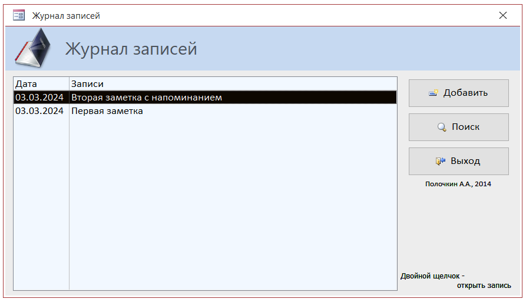
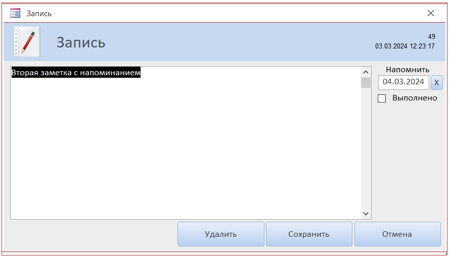
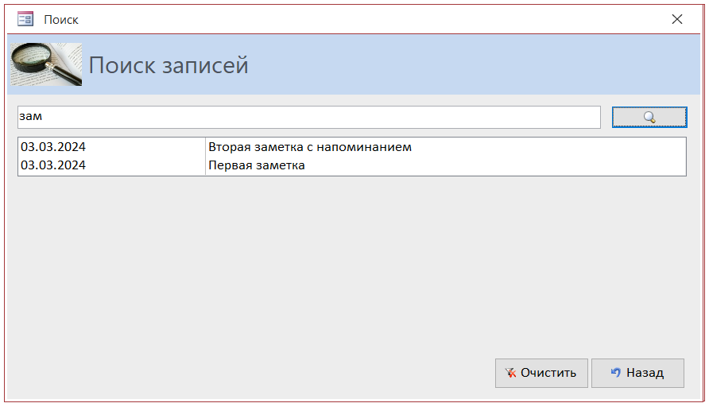
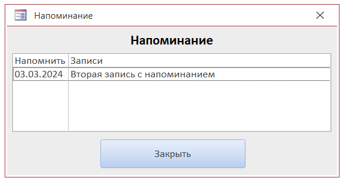

# Проект Журнал записей
Разработка 2014 года, реализация на MS Access

## Описание
Это мой экспериментальный проект по изучению и работе с MS Access. Реализация базы данных для хранения простых текстовых записей с некоторыми удобными, на мой взгляд, дополнительными функциями.

## Функционал
### Управление записями:
- Добавление
- Поиск
- Правка
- Удаление
- Добавление или удаление даты напоминания
- Добавление или снятие отметки об исполнении
- Вывод записей с напоминаниями при запуске
## Скриншоты

## Важно!
При первом запуске появится сообщение об ошибке, связанное с тем, что в целях безопасности отключены макросы. Включите макросы и создайте новую запись. В дальнейшем ошибка появляться не будет.

## Планы
- Реализовать функцию добавления периодических напоминаний (неделя, месяц, год)
